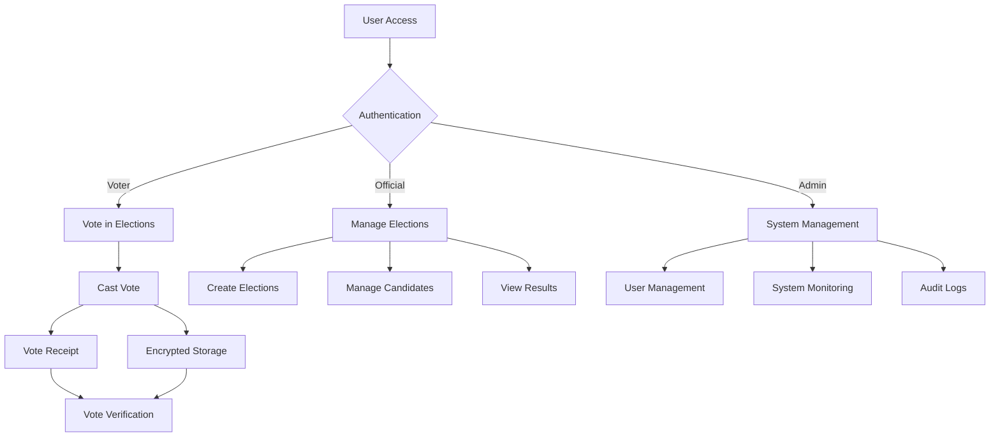
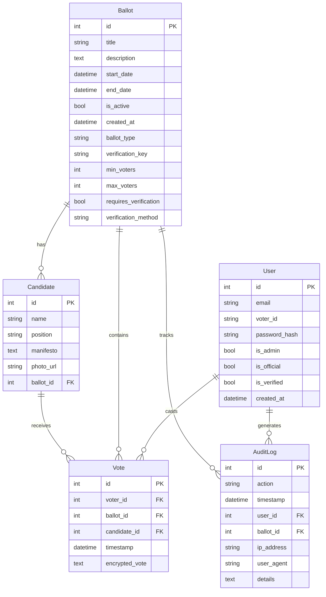

# Piga Kura - Secure Electronic Voting System

A robust, secure, and transparent electronic voting system built with Flask, designed primarily for university and institutional elections.

## Overview

Piga Kura ("cast a vote" in Swahili) provides a complete solution for conducting electronic elections with enhanced security features, role-based access control, and transparent verification mechanisms. The system is designed to handle multiple concurrent elections with different positions and candidates.



## Features
- Secure voter authentication and verification
- Role-based access control with distinct interfaces for:
  - Voters (participate in elections)
  - Election Officials (create and manage elections)
  - System Administrators (manage users and system settings)
- Real-time vote counting and result display
- Multiple concurrent ballot support
- Tamper-proof vote recording through encryption
- Vote verification system with receipts
- Election customization with different positions and candidates
- Comprehensive audit logging for transparency

## Tech Stack
- Backend: Flask/Python
- Database: SQLAlchemy
- Frontend: Bootstrap, JavaScript
- Security: JWT, Flask-Login, Bcrypt

## Getting Started
1. Clone repository
2. Create virtual environment: `python -m venv venv`
3. Activate the environment:
   - Windows: `venv\Scripts\activate`
   - Linux/Mac: `source venv/bin/activate`
4. Install dependencies: `pip install -r requirements.txt`
5. Generate encryption key: `python generate_keys.py`
6. Set environment variables in `.env` file:
   ```
   FLASK_APP=run.py
   FLASK_ENV=development
   SECRET_KEY=your_secret_key
   VOTE_ENCRYPTION_KEY=generated_key_from_step_5
   DATABASE_URL=sqlite:///voting.db
   ```
7. Initialize database: `flask db upgrade`
8. Create admin user: `flask create-admin`
9. Run application: `flask run`

## Security Features
- End-to-end encryption of votes using Fernet symmetric encryption
- Role-based access control (voter, official, admin) with visually distinct UIs
- Domain-restricted registration (example: kabarak.ac.ke)
- Audit logging for all critical actions including vote casting and election management
- Vote verification receipts and public verification page
- Secure password hashing with Werkzeug
- Protection against common web vulnerabilities

## User Roles

### Voters
- Register with institutional email
- View and participate in active elections
- Receive encrypted vote receipts
- Verify votes using receipt
- View personal voting history

### Election Officials
- Create new elections with custom positions
- Add and manage candidates
- Monitor ongoing elections
- View and generate election results
- Set election parameters (start/end dates, verification methods)

### Administrators
- Manage user accounts and permissions
- Monitor system activity through audit logs
- Access complete election data
- System configuration and troubleshooting

## Project Structure

```
piga_kura/
├── app/
│   ├── api/              # API endpoints for AJAX functionality
│   ├── models/           # Database models (User, Ballot, Candidate, Vote, AuditLog)
│   ├── routes/           # Route handlers for web interface
│   ├── services/         # Business logic and service layer
│   ├── static/           # CSS, JavaScript, and images
│   │   ├── css/
│   │   ├── js/
│   │   └── images/
│   ├── templates/        # HTML templates using Jinja2
│   │   ├── admin/        # Admin-specific templates
│   │   ├── auth/         # Authentication templates
│   │   ├── official/     # Election official templates
│   │   └── voter/        # Voter-specific templates
│   ├── cli.py            # Command-line interface commands
│   └── __init__.py       # Application factory
├── config/               # Configuration settings
├── migrations/           # Database migration scripts
├── scripts/              # Utility scripts
│   ├── create_favicon.py
│   └── create_sample_election.py
├── .env                  # Environment variables (not in version control)
├── .gitignore            # Git ignore file
├── generate_keys.py      # Script to generate encryption keys
├── requirements.txt      # Project dependencies
└── run.py                # Application entry point
```

## Database Schema



## Deployment

For production deployment, we recommend:
- Using a production WSGI server like Gunicorn
- Setting up behind Nginx as a reverse proxy
- Using PostgreSQL instead of SQLite
- Enabling HTTPS with Let's Encrypt or similar
- Setting appropriate environment variables for production

## Contributing

Contributions are welcome! Please feel free to submit a Pull Request. See [CONTRIBUTING.md](CONTRIBUTING.md) for guidelines.

## License

This project is licensed under the MIT License - see the [LICENSE](LICENSE) file for details.